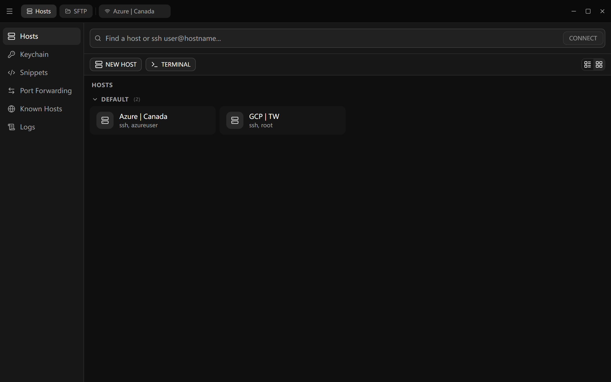
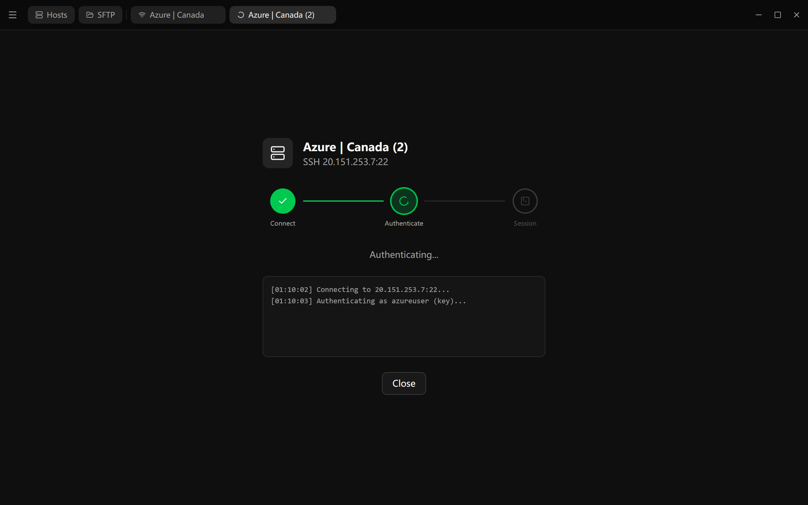
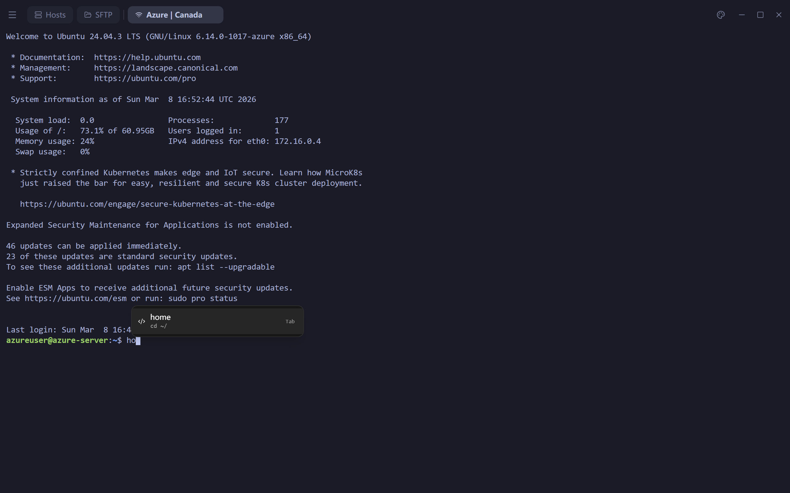
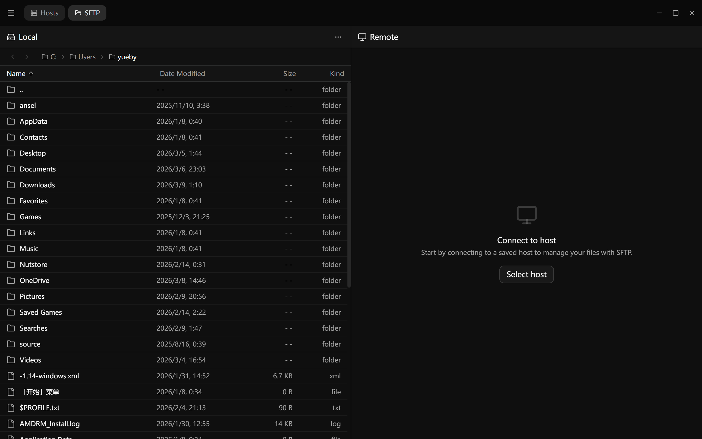

<div align="center">

# Termix

A modern, cross-platform SSH terminal client.

Built with **Tauri v2** + **React** + **Rust**

[](https://www.gnu.org/licenses/agpl-3.0)
[](https://v2.tauri.app/)
[](https://react.dev/)
[](https://www.rust-lang.org/)
[](https://www.typescriptlang.org/)

[简体中文](./README_CN.md)

</div>

## Features

- **SSH Terminal** — Connect to remote hosts via SSH with password or key-based authentication
- **Local Terminal** — Open local shell sessions with configurable shell profiles
- **SFTP File Manager** — Dual-pane file browser with drag-and-drop upload, permissions editor, and transfer queue
- **Keychain** — Securely manage SSH private keys with encrypted storage
- **Snippets** — Save and reuse frequently used commands with autocomplete
- **Session Logs** — Automatically capture terminal snapshots when closing tabs, with read-only playback
- **WebDAV Sync** — Sync connections and keychains across devices with encrypted WebDAV storage
- **Theme Support** — 13+ built-in terminal themes (Tokyo Night, Dracula, Nord, Catppuccin, etc.)
- **Cross-Platform** — Runs on Windows, macOS, and Linux

## Tech Stack

| Layer | Technology |
|-------|-----------|
| Framework | [Tauri v2](https://v2.tauri.app/) |
| Frontend | React, TypeScript, Tailwind CSS, shadcn/ui |
| Backend | Rust, russh, sqlx (SQLite), aes-gcm |
| Terminal | xterm.js with WebGL renderer |

## Getting Started

### Prerequisites

- [Node.js](https://nodejs.org/) 18+
- [pnpm](https://pnpm.io/)
- [Rust](https://www.rust-lang.org/tools/install)
- Platform-specific Tauri [prerequisites](https://v2.tauri.app/start/prerequisites/)

### Development

```bash
# Install dependencies
pnpm install

# Start development server
pnpm tauri dev
```

### Build

```bash
pnpm tauri build
```

## Screenshots

| Home | Connection Progress |
|:---:|:---:|
|  |  |

| Terminal | SFTP |
|:---:|:---:|
|  |  |

## License

This project is licensed under the [GNU Affero General Public License v3.0](./LICENSE).
