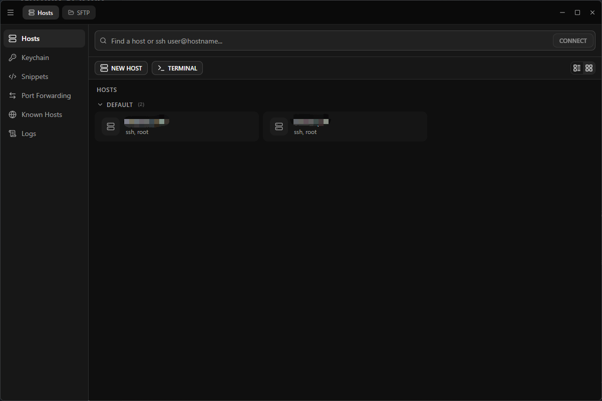
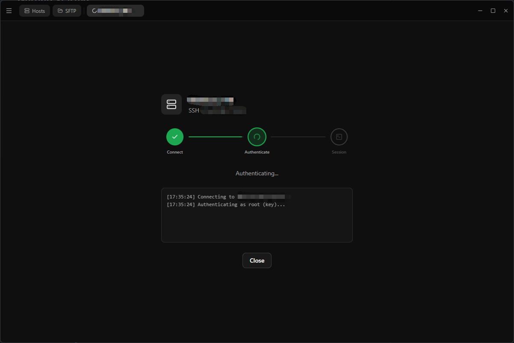
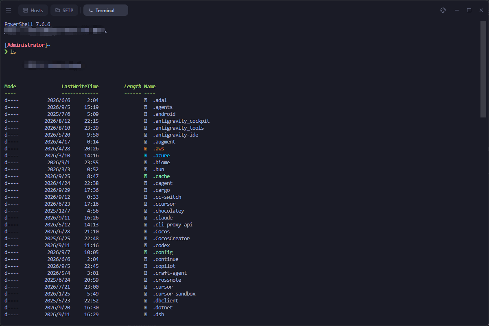
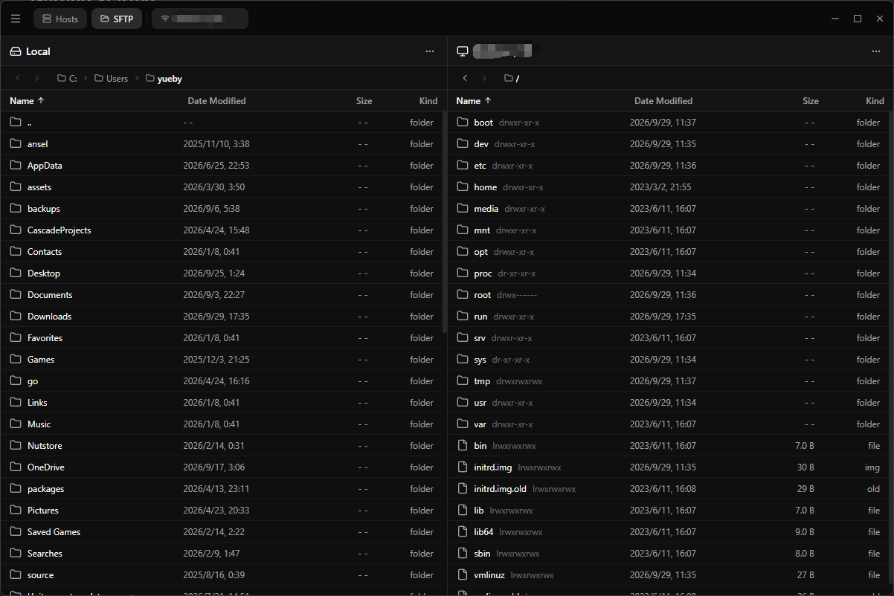

<div align="center">

# Termix

A modern, cross-platform SSH terminal client.

Built with **Tauri v2** + **React** + **Rust**

[](https://www.gnu.org/licenses/agpl-3.0)
[](https://v2.tauri.app/)
[](https://react.dev/)
[](https://www.rust-lang.org/)
[](https://www.typescriptlang.org/)
[](https://github.com/Yueby/termix/actions/workflows/ci.yml)
[](https://github.com/Yueby/termix/releases/latest)

[简体中文](./README_CN.md)

</div>

## Features

- **SSH Terminal** — Connect to remote hosts via SSH with password or key-based authentication
- **Auto Reconnect** — A dropped SSH session is retried automatically with a growing delay, and every session end is logged with its reason
- **Proxy Support** — Reach hosts through SOCKS5 or HTTP CONNECT, set globally or per connection, including a mode that follows the operating system’s own proxy settings
- **Local Terminal** — Open local shell sessions with configurable shell profiles
- **SFTP File Manager** — Dual-pane file browser with drag-and-drop upload, permissions editor, and transfer queue
- **Keychain** — Securely manage SSH private keys with encrypted storage
- **Snippets** — Save and reuse frequently used commands with autocomplete
- **Session Logs** — Automatically capture terminal snapshots when closing tabs, with read-only playback
- **WebDAV Sync** — Sync connections and keychains across devices with encrypted WebDAV storage
- **Theme Support** — 13+ built-in terminal themes (Tokyo Night, Dracula, Nord, Catppuccin, etc.)
- **Cross-Platform** — Runs on Windows, macOS, and Linux

## Tech Stack

| Layer | Technology |
|-------|-----------|
| Framework | [Tauri v2](https://v2.tauri.app/) |
| Frontend | React, TypeScript, Tailwind CSS, shadcn/ui |
| Backend | Rust, russh, sqlx (SQLite), aes-gcm |
| Terminal | xterm.js with WebGL renderer |

## Download

Installers for every supported platform are on the
[latest release](https://github.com/Yueby/termix/releases/latest): an `.exe` installer
for Windows, a `.dmg` for macOS (separate builds for Apple Silicon and Intel), and
an `.AppImage` or `.deb` for Linux.

Installed builds check for updates on launch and can install them in place. The
update manifests are signed, so a build only accepts an update signed with the same
key it was released with.

## Getting Started

### Prerequisites

- [Node.js](https://nodejs.org/) 24 — Vite 8 needs 22.12 or newer
- [pnpm](https://pnpm.io/) 11 — pinned via `packageManager`, so `corepack enable` is enough
- [Rust](https://www.rust-lang.org/tools/install)
- Platform-specific Tauri [prerequisites](https://v2.tauri.app/start/prerequisites/)

### Development

```bash
# Install dependencies
pnpm install

# Start development server
pnpm tauri dev
```

### Build

```bash
pnpm tauri build
```

## Screenshots

| Home | Connection Progress |
|:---:|:---:|
|  |  |

| Terminal | SFTP |
|:---:|:---:|
|  |  |

## Contributing

Bug reports, feature requests and pull requests are welcome — see
[CONTRIBUTING.md](./CONTRIBUTING.md) for the development setup, the checks CI runs,
and the release process. Each release’s notes are on the
[releases page](https://github.com/Yueby/termix/releases).

## License

This project is licensed under the [GNU Affero General Public License v3.0](./LICENSE).
